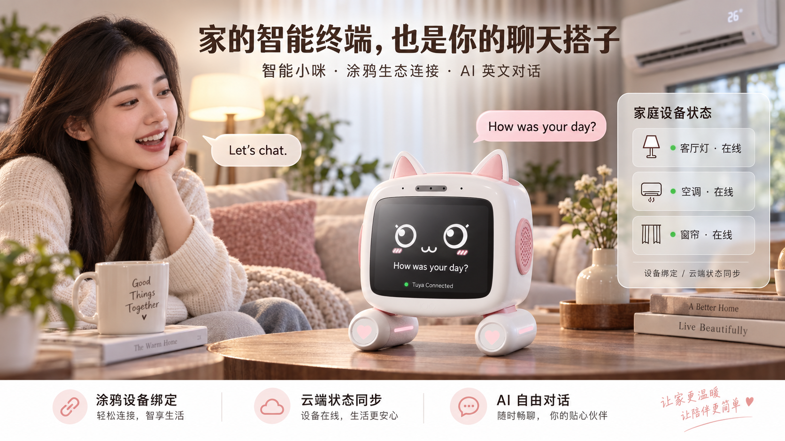
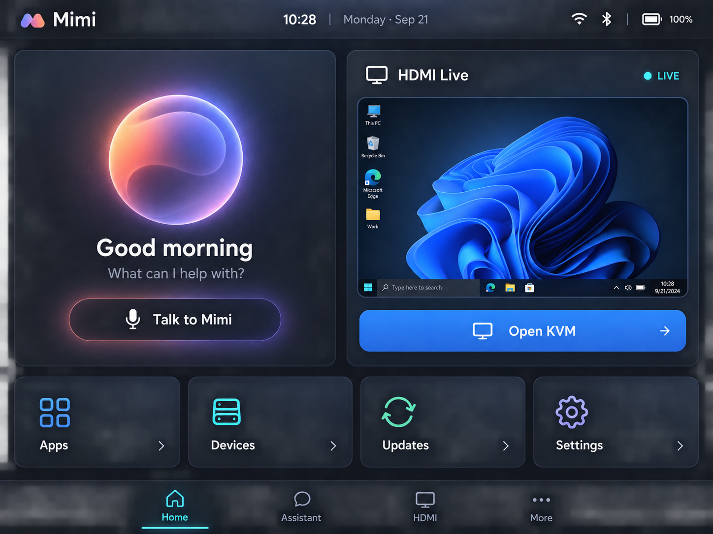
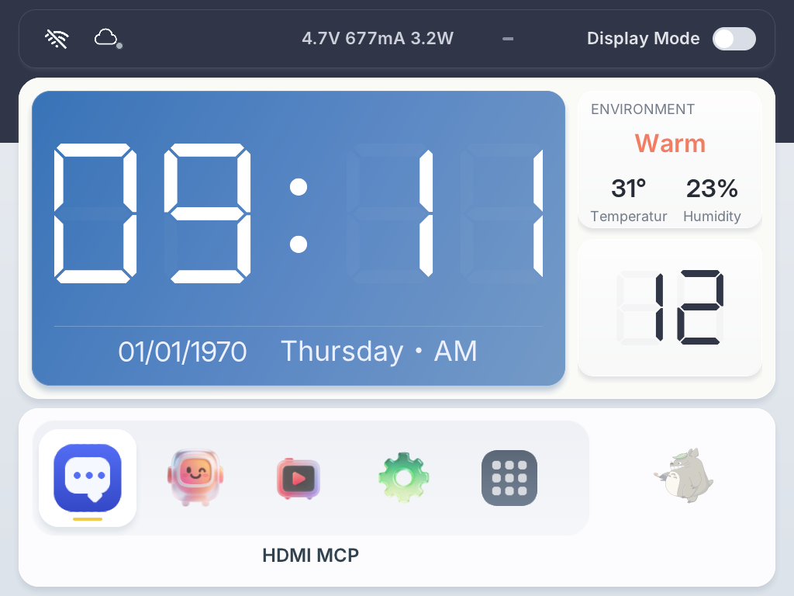
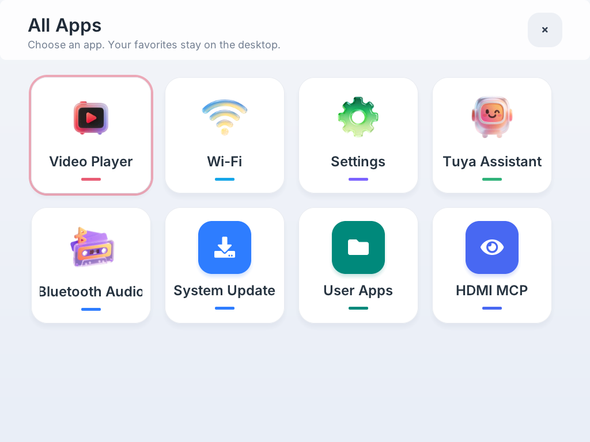
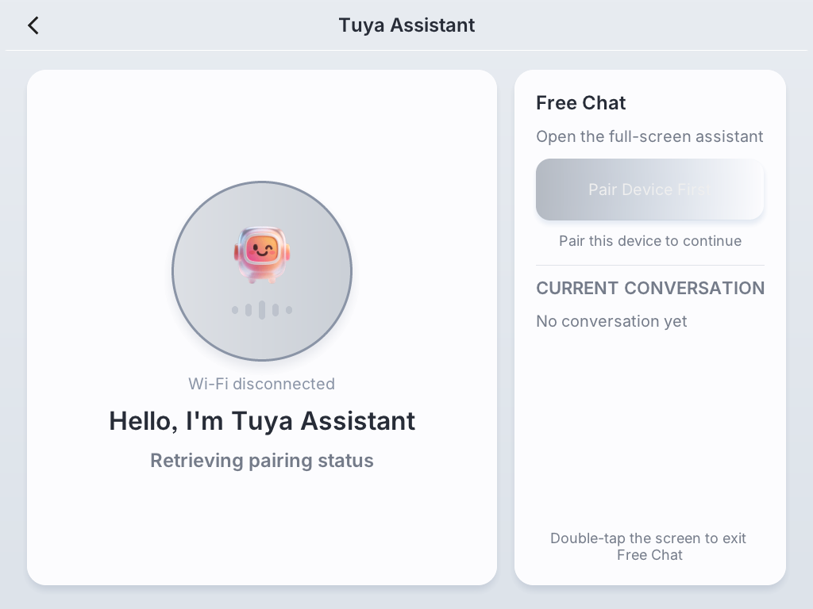
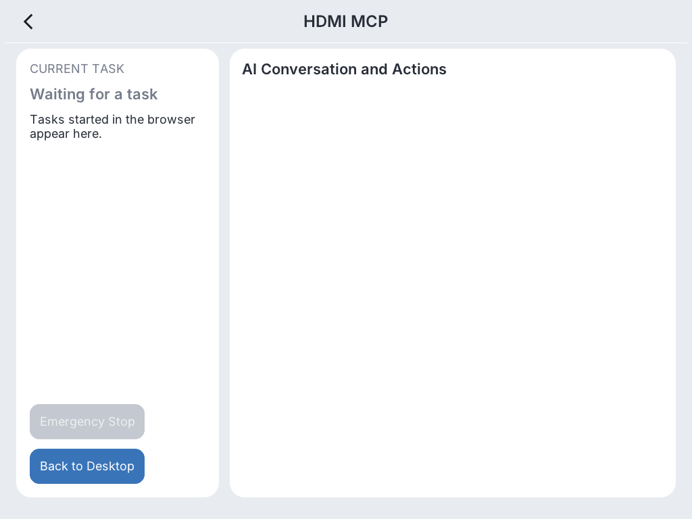
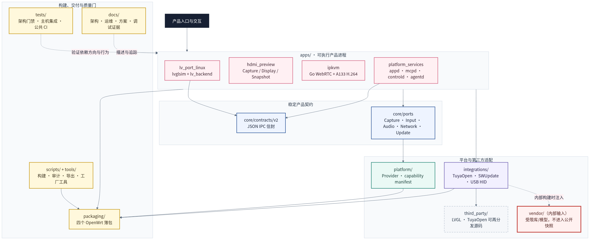

# 智能桌面小咪（Smart Desktop Mimi）

[English](README.en.md) | 中文（默认）

“智能桌面小咪”是一套运行在全志 A133/Tina Linux 上的桌面 AI 终端，集成
桌面 UI、涂鸦 AI 自由对话、Wi-Fi/蓝牙、HDMI 预览、浏览器 IPKVM、USB HID、
WS2812 状态灯和 A/B OTA。设备密钥采用一机一密运行时注入，不进入通用固件。

本仓库是该产品的**产品代码层**。Tina SDK 只是构建环境；本仓库拥有
应用源码、产品打包规则和可再分发的第三方集成胶水。受限 SDK、vendor 二进制、
工厂数据库和密钥属于私有构建输入，不进入公开快照。



## 产品亮点

- 1024×768 LVGL 桌面，提供适合触控的首页、应用导航、设备状态、设置和升级界面。
- 集成涂鸦 AI 自由对话；设备凭据在量产阶段一机一密注入，不写入通用固件或公开源码。
- 集成 HDMI 预览、浏览器 WebRTC IPKVM 和 USB 键盘/鼠标 HID 控制。
- 支持 Wi-Fi、蓝牙音频、WS2812 状态灯和带签名校验的 A/B OTA。
- 采用分层平台架构、版本化接口和失效关闭的公开源码导出流程。

## 界面截图

第一张为新版首页的设计与实现目标；其余图片均为 A133 设备端 1024×768
界面的实际验证截图。



| 桌面 | 应用列表 |
| --- | --- |
|  |  |
| AI 自由对话 | HDMI MCP |
|  |  |

更多产品效果图、方案说明和演示分镜见
[智能桌面小咪解决方案资料包](docs/solution/README.md)。

## 源码架构与函数调用关系

仓库提供 9 张可维护的中文工程图，覆盖产品系统、源码模块、运行时进程、启动时序、
UI/Backend、AI/Tuya、HDMI/IPKVM/HID/Agent、用户 APP 与云端 OTA。每张图同时提供
Mermaid 源码、SVG 和高清 PNG。

[查看完整源码架构与函数调用图集](docs/architecture-diagrams/README.md)



## 核心原则：SDK 是 SDK，产品代码是产品代码

- 产品源码（`apps/`、TuyaOpen、vendor 库）**永远只在产品仓库**，不拷进 SDK。
- 应用在产品仓库内 **out-of-tree 构建**，只借用 SDK 的交叉工具链 + staging_dir。
- SDK 侧只保留四个薄包：`aitvbox-suite`、`aitvbox-platform`、
  `aitvbox-usb-hid`、`aitvbox-ipkvm`。pack 时通过
  `$AITVBOX_PRODUCT_BUILD` 读取产品产物，四个包默认全部关闭。
- `sync_to_sdk.sh` 只拷薄包，**不搬源码、不打开产品包开关、不污染 SDK**。
- `build_firmware.sh` 临时打开产品包，打包后恢复纯 SDK 模式并清理产品残留。

这样 SDK 始终是纯净的上游快照（可 `distclean` 后随时替换），"单独编 SDK"与
"编产品固件"两条路径彻底解耦。完整 A133 固件还需要合法取得的 Tina SDK 和受限
依赖；公开仓库不会伪装成包含这些输入的全离线构建包。

## 目录结构

- `apps/lv_port_linux/`: LVGL UI 进程（lvglsim）+ 后端进程（lv_backend）。
- `apps/hdmi_preview/`: HDMI 输入采集/直显助手。
- `apps/ipkvm/`: A133 H.264 发送器、鉴权 Web 页面和 WebRTC/HID 服务。
- `integrations/tuyaopen/`: TuyaOpen 的 A133 交叉构建集成层（构建脚本、配置、补丁）。
- `integrations/swupdate/`: A/B OTA 集成层（sw-description、签名配置、`keys/swupdate_public.pem`、修复版 `files/bluetooth_init`），由 `build_firmware.sh`/`build_swu.sh` 在 trap 窗口内注入 SDK、退出还原。
- `packaging/aitvbox-suite/`: UI、模型和产品资产薄包。
- `packaging/aitvbox-platform/`: 可信 APP、MCP 和 Agent 薄包。
- `packaging/aitvbox-usb-hid/`: USB HID 与 ADB 模式薄包。
- `packaging/aitvbox-ipkvm/`: 浏览器 IPKVM 与 FRPC 转发薄包。
- `scripts/`: 审计、同步、构建、固件打包、产品包开关等辅助脚本。
- `docs/`: 构建与维护说明。
- `third_party/TuyaOpen/`: vendored TuyaOpen 可再分发源码（主仓 + platform/LINUX，删 `.git`）。
- `vendor/`: 内部构建使用的受限 A133_B6 音频/KWS 库与模型；本地可存在，但不进入公开快照。
- `build/`: 应用构建产物输出目录（gitignore，由 `build_apps.sh` 生成）。

公开源码不是开发仓的原样镜像。`docs/public-release.json` 以逐文件规则保留许可已确认的
二进制素材，并排除非 A133 示例、测试语料、netboot ISO 和未分类预编译库；导出结果会
附带排除报告、体积报告、SPDX/CycloneDX SBOM 与全文件 SHA-256，且不会自动推送远程。

## 用户开发入口

- 用户 APP 从创建、UI/action、签名到 ADB 上传：
  [docs/user-app-development-guide.md](docs/user-app-development-guide.md)
- IPKVM 浏览器内的 HDMI + HID MCP 控制、板端模型任务，以及可选的
  ADB/SSH MCP 调试：
  [docs/mcp-user-guide.md](docs/mcp-user-guide.md)
- Windows/Linux 浏览器 KVM、HTTPS 与 FRP 外网转发：
  [docs/ipkvm-user-guide.md](docs/ipkvm-user-guide.md)
- 平台已实现模块、用户流程和安全边界：
  [docs/platform-feature-overview.md](docs/platform-feature-overview.md)
- 系统启动、角色、信任链、APP/MCP 状态机和量产流程：
  [docs/platform-business-logic.md](docs/platform-business-logic.md)
- 本分支架构决策、缺陷修复、验证和遗留事项：
  [docs/development-memory-supportappconfig.md](docs/development-memory-supportappconfig.md)
- HDMI/KVM、英文界面和原始帧样本等调试证据：
  [docs/debug-evidence/README.md](docs/debug-evidence/README.md)
- 设备调试 Skills、恢复基线和安全注意事项：
  [.codex/skills/aitvbox-debug-hdmi-hid/SKILL.md](.codex/skills/aitvbox-debug-hdmi-hid/SKILL.md)
- 面向品牌商与行业客户的产品方案、商业化计划、PDF 和演示分镜：
  [智能桌面小咪解决方案资料包](docs/solution/README.md)

## 构建流程概览

```sh
# 1. 准备 SDK（一次性，提供工具链 + staging_dir）
cd /home/ubuntu/A133-Tina5.0-v0.9
source build/envsetup.sh
./build.sh kernel
./build.sh openwrt_rootfs

# 2. 准备产品仓库
cd /home/ubuntu
git clone <AI-DeskTopBox.git> AI-DeskTopBox
cd AI-DeskTopBox
# 仅内部开发仓需要：
git submodule update --init --recursive
# 公开候选仓已将固定版本 LVGL 实体化，不需要 submodule。

# 2.1 无需配置 Tuya UUID/AuthKey：通用固件不包含设备密钥。
#     每台设备烧录后由产线运行 provision_tuya_license.sh 写入唯一 License。

# 3. 一键检查环境、显示硬件规格、自动发现 SDK，再完整编译/打包/验收/归档
./scripts/auto_build_package.sh --check-only
./scripts/auto_build_package.sh
```

若 SDK 不在默认路径，可加 `--sdk-root /path/to/A133-Tina-SDK` 或设置
`AITVBOX_A133_SDK`。脚本会一次性检查主机依赖、CPU/内存/磁盘、源码输入与 SDK
目标配置；完整构建仍由安全的 `build_release.sh` 唯一流水线执行，不会自动烧录设备。

最终固件（脚本结束后 SDK 会恢复纯模式）：

```text
/home/ubuntu/AI-DeskTopBox/build/releases/<版本-commit-时间>/firmware/a133_linux_b6_uart0.img
```

完整 SDK/普通固件/签名 OTA 的命令、产物和失败恢复见
[SDK 完整编译与发布手册](docs/sdk-build-and-release.md)。

## 单独编译 SDK（不碰产品代码）

若只想编译纯 SDK rootfs、不打包产品应用，SDK 默认就应保持产品包关闭：

```sh
./scripts/toggle_product.sh off /home/ubuntu/A133-Tina5.0-v0.9
cd /home/ubuntu/A133-Tina5.0-v0.9
source build/envsetup.sh
./build.sh openwrt_rootfs
```

`toggle_product.sh off` 在三处 OpenWrt 配置中同时关闭上述四个包，并清理 SDK
OpenWrt 输出目录中的产品残留和旧 release IPK，再恢复 SDK 原生 `adbd`。
产品固件请走 `build_firmware.sh`，它会临时打开产品包并在结束后恢复关闭。

## 产品固件包含的产品文件

`aitvbox-suite` 薄包自身安装以下文件到 rootfs：

```text
/usr/bin/lv_backend
/usr/bin/lvglsim
/usr/bin/hdmi_preview
/usr/bin/your_chat_bot_QIO_1.0.1.bin
/usr/bin/aitvbox-start-ui
/usr/lib/libMNN.so
/usr/lib/libMNN_Express.so
/usr/share/tuyaopen_models/mdtc_chunk_300ms.mnn
/usr/share/tuyaopen_models/tokens.txt
/usr/share/fonts/SarasaUiSC-Regular.ttf
/usr/share/fonts/SarasaUiSC-SemiBold.ttf
/usr/share/aitvbox/emotions/*.json  # 10 个 Lottie 情绪素材（static/investigate/ponder/question/
                                    #   smile/sad/angry/panic/shocked/asleep，见 docs/ai-emotion-ui.md）
/etc/init.d/aitvbox-data
/etc/init.d/aitvbox
/etc/rc.d/S95aitvbox-data
/etc/rc.d/S99aitvbox
/etc/swupdate_public.pem        # OTA 验签公钥
/etc/aitvbox-version            # 固件版本戳（AITVBOX_VERSION 来自 VERSION 文件，见 docs/versioning.md）
/etc/aitvbox-tuya-pid           # 本固件实际使用的涂鸦 PID，供出厂三方校验
/etc/100ask/                    # 100ask Cloud 目录（运行时写 device_sig/secret，见下）
/etc/100ask/cloud.conf          # 100ask Cloud 服务器配置（可选，缺失用默认值；来自 secrets/100ask_cloud.env）
/etc/100ask/ca.crt              # 100ask Cloud TLS CA（可选，仅 secrets/100ask_ca.crt 存在时才装入；
                                #   运行时 cloud.conf 的 USE_TLS=1 时需要）
```

> 完整清单以 `packaging/aitvbox-suite/Makefile` 的 install 段为准。

`aitvbox-platform` 另行安装 `aitvbox-appctl`、`aitvbox-app-policy`、
`aitvbox-adminctl`、`aitvbox-appd`、`aitvbox-mcpd`、`aitvbox-agentctl`、
`aitvbox-agentd`、`aitvbox-controld` 及对应 init 脚本；
`aitvbox-usb-hid` 安装 HID 控制/测试工具及 USB/ADB init 脚本；
`aitvbox-ipkvm` 安装浏览器服务、A133 H.264 发送器、FRPC 管理和 init 脚本。

> 100ask Cloud 的 `/etc/100ask` 是空目录出厂，运行时由 `lv_backend` 写 `device_sig`（出厂烧录，每台不同）与 `secret`（provision 注册下发），并在 `aitvbox-data.init` 中被 bind 到 `/overlay` 跨 OTA 保留。机制见 [docs/cloud.md](docs/cloud.md)。

`boot-play` 是 `aitvbox-suite` 的 OpenWrt 依赖包，不由 `aitvbox-suite/install`
直接复制；它提供早期启动画面与 `/etc/init.d/play`。

## 启动流程概览

```text
/etc/rc.d/S25play
  -> /etc/init.d/play
  -> /sbin/boot-play boot &

/etc/rc.d/S95aitvbox-data
  -> 挂载 /overlay 持久化目录
  -> bind 蓝牙 MAC/配对、WiFi、Tuya KV、100ask Cloud（device_sig/secret/cloud.conf）数据

/etc/rc.d/S96bluetooth_init
  -> 初始化 AIC 蓝牙
  -> hciattach /dev/ttyS1 aic
  -> hciconfig hci0 up

/etc/rc.d/S99aitvbox
  -> /etc/init.d/aitvbox
  -> lv_backend
       -> 管理 Tuya chatbot 与 hdmi_preview --service
  -> aitvbox-start-ui
       -> 等待 /tmp/lv_port_linux_backend.sock
       -> 结束 boot-play
       -> exec /usr/bin/lvglsim
```

详细运行链路见 [docs/runtime.md](docs/runtime.md)。

蓝牙启动、软重启稳定性和后端非阻塞延迟初始化见 [docs/bluetooth.md](docs/bluetooth.md)。

WS2812 状态灯（内核驱动、`service_led` 公共资源模型、场景与验证）见 [docs/led.md](docs/led.md)。

## OTA 升级

SWUpdate A/B 双槽 OTA，LVGL UI 菜单触发，升级 kernel + rootfs（含 LVGL 应用、Tuya chatbot、MNN 库/模型），带失败自动回滚。不使用 Tuya 云 OTA——一个 `.swu` 覆盖全部。

- A/B 双槽 + 回滚（bootcount + altbootcmd）是出厂地基，由 `scripts/inject_sdk_files.sh` 在构建 trap 窗口内注入 SDK、退出还原。**地基注入受 `AITVBOX_OTA=1` 门控**：`build_firmware.sh` 仅在该环境变量为 `1` 时同时执行 `toggle_ota.sh on` 与 `inject_sdk_files.sh apply`（trap 里对应 revert/off 还原），并开 `swupdate`/`uboot-envtools` 包。未设置 `AITVBOX_OTA` 时 `build_firmware.sh` 只出普通单槽固件，不会把 A/B 地基带进 SDK。所以编 OTA 固件须显式：`AITVBOX_OTA=1 ./scripts/build_firmware.sh <sdk-root>`。
- 升级包由 `scripts/build_swu.sh` 生成（全量 + RSA 签名），产物落 `build/swu/`。
- 设备端服务 `apps/lv_port_linux/src/system/service_ota.c`：CHECK → DOWNLOAD → APPLY → COMMIT，状态经 IPC 上报 UI。

完整机制、验证步骤、已知风险见 [docs/ota.md](docs/ota.md)。

## 100ask Cloud 云端 OTA

产品对接 **100ask IoT Cloud** 做云端 OTA：设备连云 → 云端推送 → 静默下载
（顶栏云徽章显示蓝点 + 进度条，不全屏打断）→ 下完橙点闪 + 全屏模态框提示安装 →
用户确认后复用上述 A/B 刷写链路。设备认证用方式1（芯片 cpuid 作 deviceId + 出厂 ECDSA
签名 + provision 注册获取 secret）。固件只编一次，每台差异只有
`/etc/100ask/device_sig`（出厂数据）。

- 后端服务 `apps/lv_port_linux/src/system/service_cloud.c`：MQTT 连云、收 OTA 推送、
  静默下载（复用 `service_ota`）。
- 100ask SDK 是仓库外可选私有 provider；公开版默认使用无网络 stub。内部构建需显式设置
  `AITVBOX_ENABLE_100ASK_CLOUD=ON` 与 `AITVBOX_100ASK_SDK_ROOT=/绝对路径`。
- UI：顶栏云徽章（连接色 + OTA 下载/待装反馈，`desktop_status_bar` / `ui_helpers`）+
  安装模态框（`src/ui/cloud_ota_modal.c`）。

架构、顶栏状态表、凭据注入、明文/TLS、OTA 推送格式、联调步骤见 [docs/cloud.md](docs/cloud.md)。
固件版本号规范（云端 OTA 匹配依据）见 [docs/versioning.md](docs/versioning.md)。

## Submodule 与 vendor 说明

- 内部开发仓中 `apps/lv_port_linux/lvgl` 是 Git submodule，clone 后需
  `git submodule update --init`。无历史公开导出会把已复核的精确提交转为普通源码，
  并删除私有 submodule 元数据。
- `third_party/TuyaOpen` 已 **vendored**（非 submodule）：公开候选包含主仓源码和
  platform/LINUX（删 `.git` 历史），不包含下载工具链 `.tools` 和生成目录。升级源码用
  `scripts/vendor_tuyaopen.sh`，但不得把本地工具缓存强制加入公开候选。
- TuyaOpen 的 A133_B6 音频/KWS 库与唤醒模型在内部构建机的 `vendor/` 下；
  `scripts/prepare_tuyaopen_build_root.sh` 会把它们注入 `platform/LINUX` 构建副本。
  这些受限输入不进入公开仓库。
  详见 [docs/tuyaopen.md](docs/tuyaopen.md)。

详细构建说明见 [docs/build.md](docs/build.md)。

## Tuya 设备凭据（重要）

Tuya 聊天机器人运行时需要真实设备凭据（UUID + AuthKey）才能连上 Tuya MQTT
（`m2.tuyacn.com:8883`）。产品采用**一机一密、运行时加载**：通用固件只包含 PID，
不包含任何 UUID/AuthKey。每台设备在产线烧录后写入唯一 License。

为当前设备准备一个仅包含以下两行的 `license.env`：

```sh
cat > /secure/path/license.env <<'EOF'
TUYA_OPENSDK_UUID=你的UUID
TUYA_OPENSDK_AUTHKEY=你的AuthKey
EOF

./scripts/provision_tuya_license.sh /secure/path/license.env
```

- 脚本通过 adb 原子写入 `/factory/tuya/license.env`，读回校验且固定权限为 `0600`。
- `/factory/tuya` 启动时 bind 到 `/overlay/factory/tuya`，跨 A/B OTA 保留。
- 缺失或非法 License 时，涂鸦进程等待产线写入，不会用假凭据连接云端。
- 用户恢复出厂只清除涂鸦激活/绑定 KV，不删除工厂 License。

完整量产流程见 [docs/tuyaopen.md](docs/tuyaopen.md) 的“Tuya 一机一密”一节。
