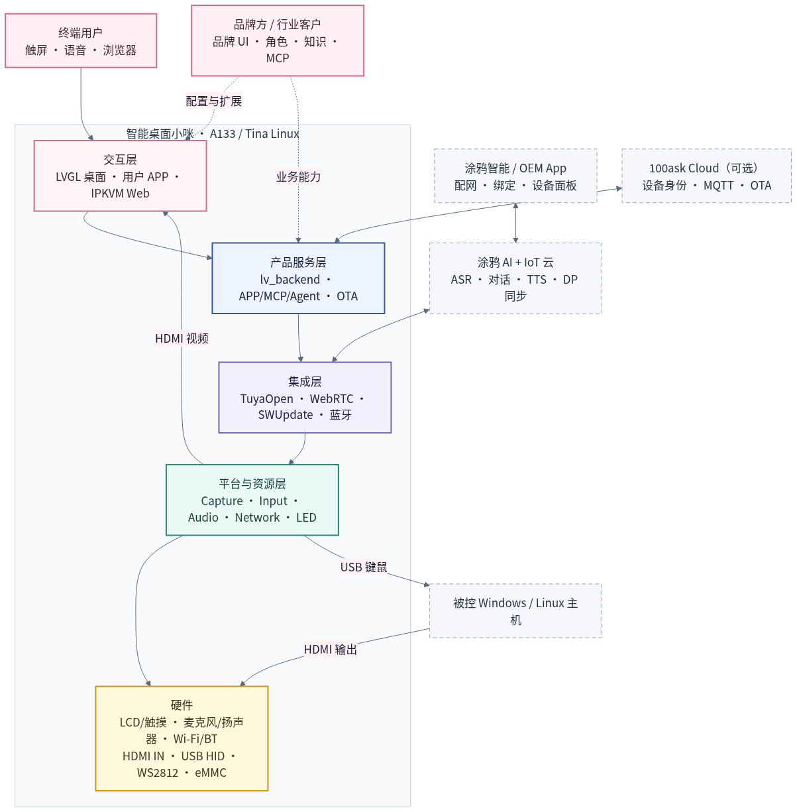
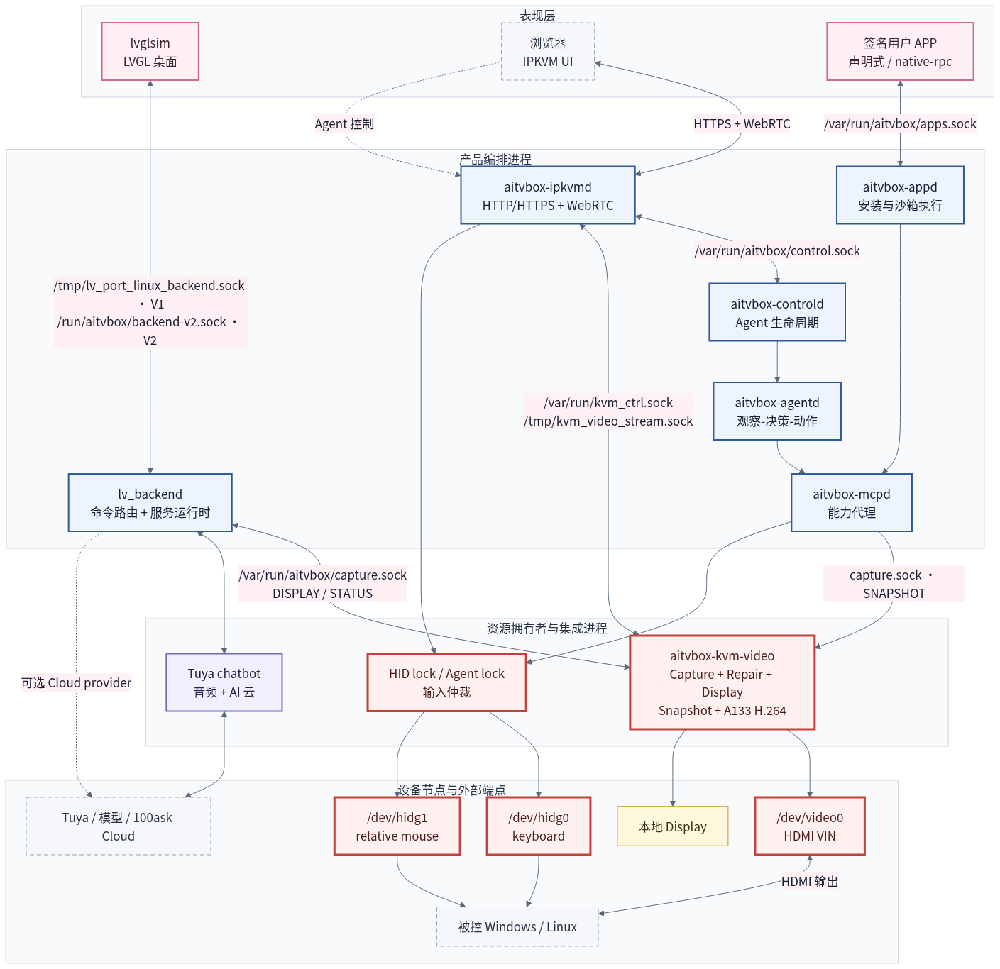
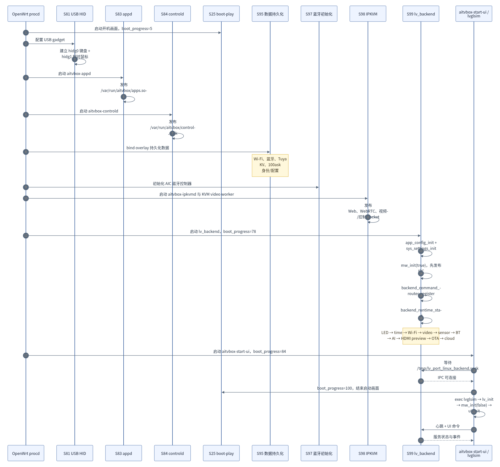
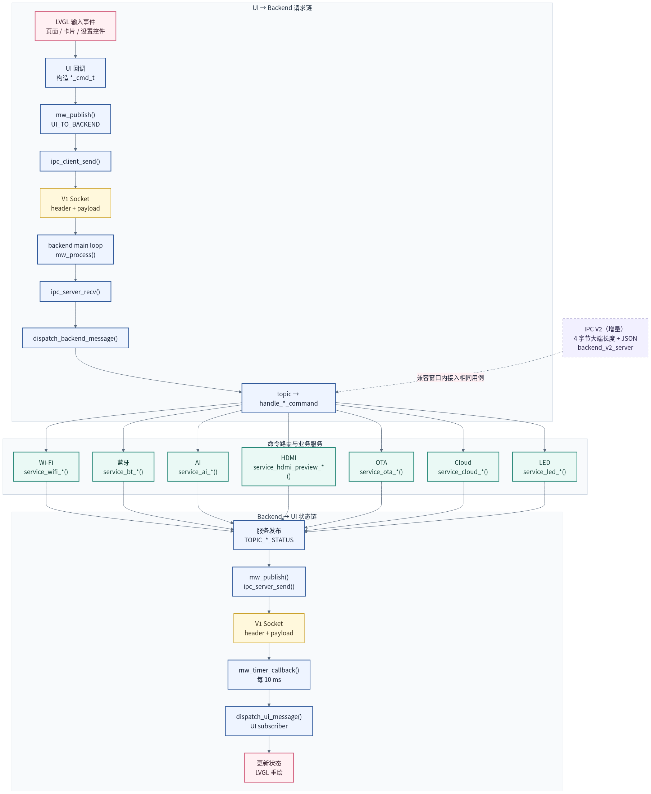
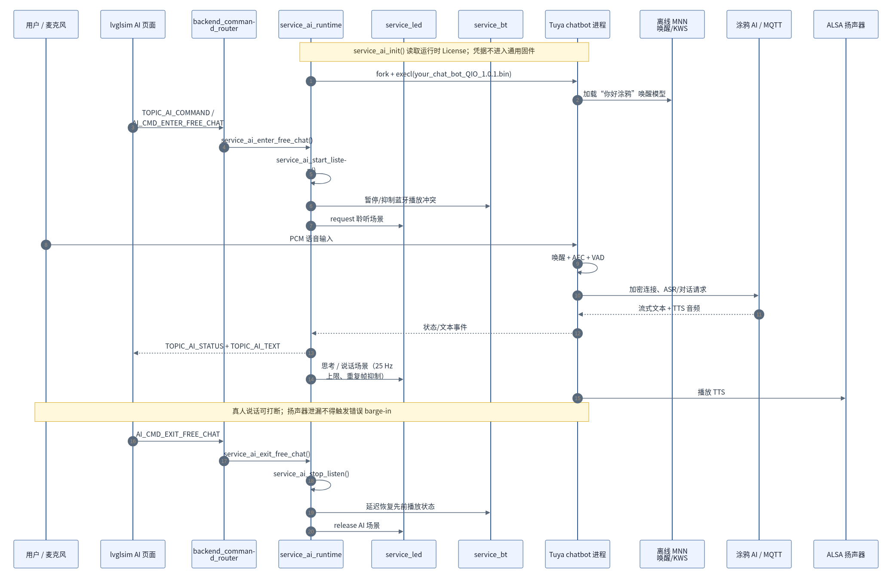
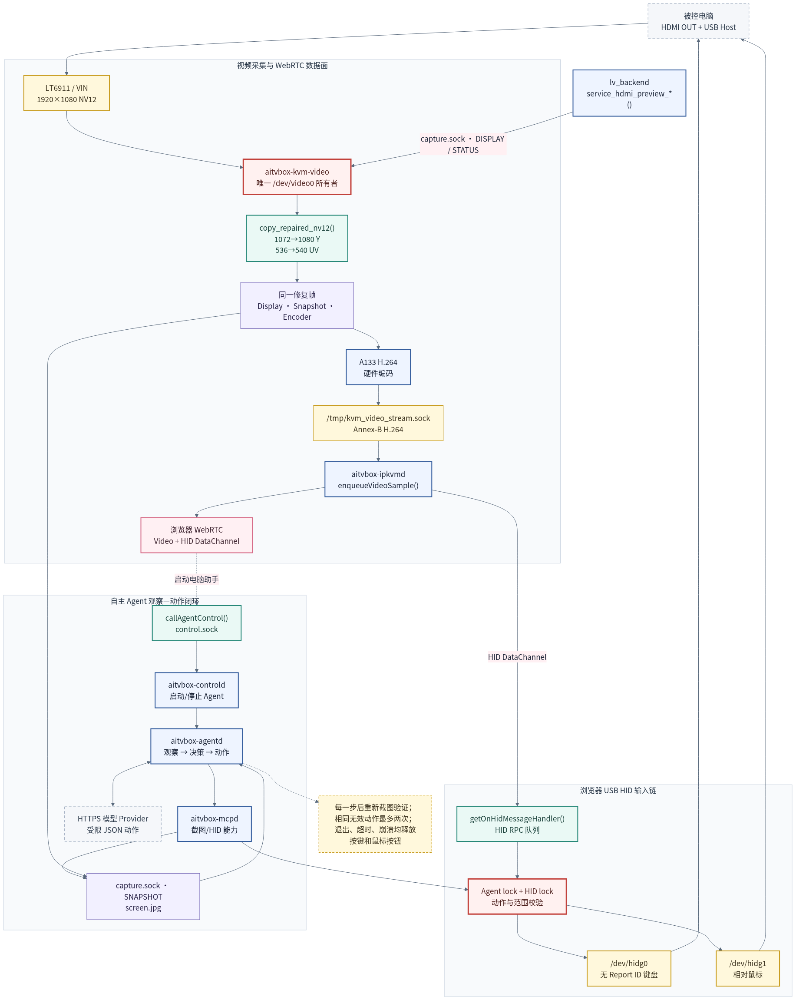
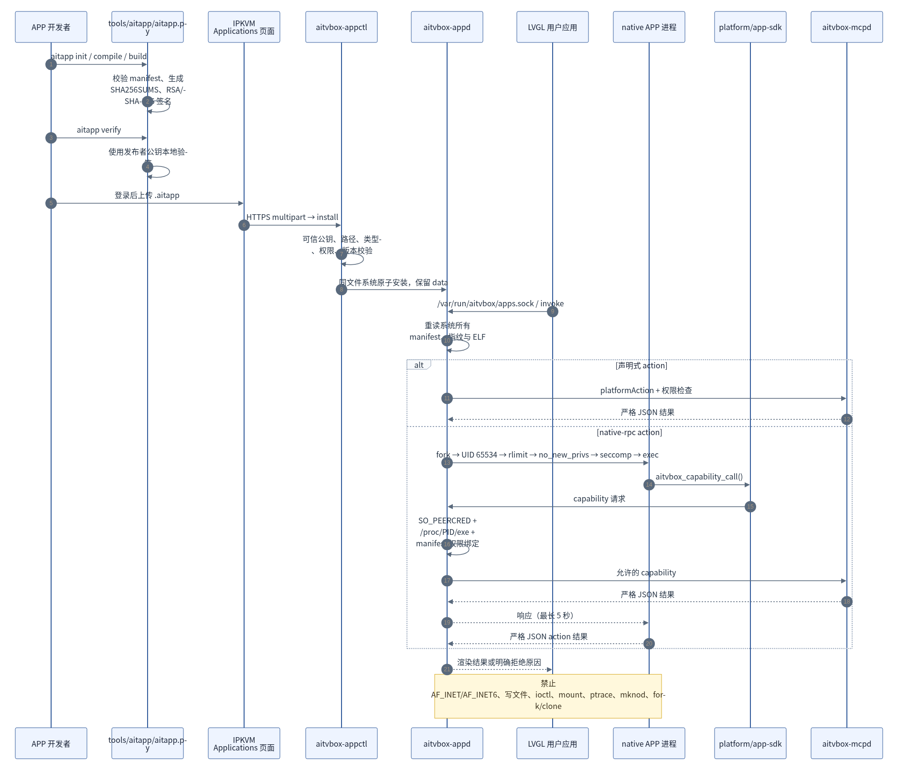
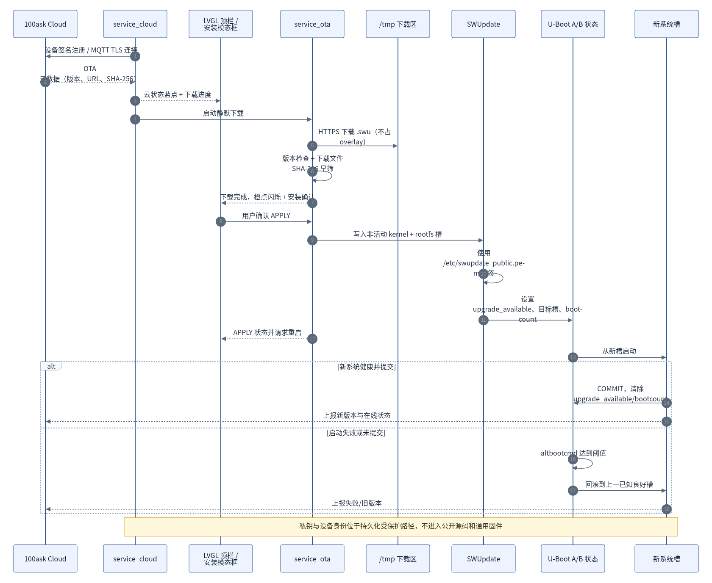

# 智能桌面小咪源码架构与函数调用图集

本图集依据 A133 参考实现的当前源码整理，面向方案介绍、源码阅读和故障定位。
图中的第三方组件只显示产品使用的接口边界，不展开 LVGL、TuyaOpen、Pion WebRTC
等上游项目的内部调用。

## 阅读约定

- 实线箭头表示进程内调用、数据流或明确的控制关系。
- 虚线箭头表示可选集成、兼容路径或配置关系。
- 红色粗边框表示安全边界或独占硬件资源。
- 灰色虚线框表示设备外部系统或第三方服务。
- 图中函数、进程、Socket 和设备节点保持源码中的原始名称。

每张图均提供 [Mermaid 源码](sources/)、可缩放 SVG 和高清 PNG。重新生成全部图片：

```bash
./tools/render_architecture_diagrams.sh
```

渲染脚本固定 Mermaid CLI 版本；首次运行需要 npm 网络访问及 Chromium/Chrome，
也可通过 `PUPPETEER_EXECUTABLE_PATH` 指定浏览器。

## 1. 产品系统总览

面向客户与开发人员说明设备、云、被控电脑和产品软件的总体关系。

[SVG](rendered/01-product-system-overview.svg) · [PNG](rendered/01-product-system-overview.png) · [Mermaid](sources/01-product-system-overview.mmd)



## 2. 源码模块架构

展示产品进程、稳定契约、平台适配、第三方集成、交付工具与测试门禁的依赖方向。

[SVG](rendered/02-source-module-architecture.svg) · [PNG](rendered/02-source-module-architecture.png) · [Mermaid](sources/02-source-module-architecture.mmd)


## 3. 运行时进程与 IPC 拓扑

展示设备上的主要进程、Unix Socket、视频通道和独占设备节点。

[SVG](rendered/03-runtime-process-ipc-topology.svg) · [PNG](rendered/03-runtime-process-ipc-topology.png) · [Mermaid](sources/03-runtime-process-ipc-topology.mmd)



## 4. 系统启动时序

从 OpenWrt procd 启动到后端服务就绪、LVGL 接管启动画面的完整顺序。

[SVG](rendered/04-system-boot-sequence.svg) · [PNG](rendered/04-system-boot-sequence.png) · [Mermaid](sources/04-system-boot-sequence.mmd)



## 5. UI—Backend 函数调用关系

展示 LVGL 事件如何经过 middleware、IPC、命令路由到达服务，并把状态回传 UI。

[SVG](rendered/05-ui-backend-function-calls.svg) · [PNG](rendered/05-ui-backend-function-calls.png) · [Mermaid](sources/05-ui-backend-function-calls.mmd)



## 6. AI 与 Tuya 对话调用链

展示自由对话从 UI 指令、唤醒与音频前处理到云端响应、TTS、灯效和蓝牙恢复的链路。

[SVG](rendered/06-ai-tuya-conversation-calls.svg) · [PNG](rendered/06-ai-tuya-conversation-calls.png) · [Mermaid](sources/06-ai-tuya-conversation-calls.mmd)



## 7. HDMI、IPKVM、HID 与 Agent 调用链

展示单一采集所有权、底边修复、H.264/WebRTC、浏览器 HID 以及自主 Agent 的闭环。

[SVG](rendered/07-hdmi-ipkvm-hid-agent-calls.svg) · [PNG](rendered/07-hdmi-ipkvm-hid-agent-calls.png) · [Mermaid](sources/07-hdmi-ipkvm-hid-agent-calls.mmd)



## 8. 用户 APP 信任与调用链

展示 APP 构建签名、上传安装、原子更新、native 沙箱和能力权限检查。

[SVG](rendered/08-user-app-trust-call-chain.svg) · [PNG](rendered/08-user-app-trust-call-chain.png) · [Mermaid](sources/08-user-app-trust-call-chain.mmd)



## 9. 云端 OTA 调用链

展示云端推送、静默下载、签名校验、A/B 写入、提交与失败回滚。

[SVG](rendered/09-cloud-ota-call-chain.svg) · [PNG](rendered/09-cloud-ota-call-chain.png) · [Mermaid](sources/09-cloud-ota-call-chain.mmd)



## 边界说明

- A133/B6 是当前参考实现；其他 SoC 目录表示端口骨架，不代表已完成板端验证。
- V1 IPC 仍承担现有 UI/Backend 通信，V2 是兼容窗口内的增量接口。
- 量产 USB 输入使用分离的键盘与相对鼠标设备；组合 Report ID 仅作维修回退。
- 100ask Cloud 是可选私有 provider；公开构建使用无网络 stub。
- 图集不替代接口定义、测试和板端验证，行为以源码和版本化契约为准。
