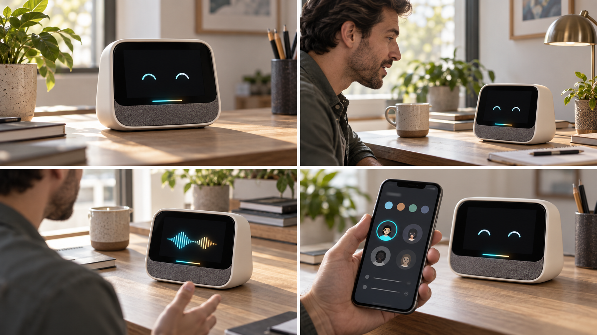

# 智能桌面小咪 60 秒演示分镜

> 图片为视频前期视觉分镜，产品外观和手机界面均为概念表达。

## 演示目标

在 60 秒内让客户理解：设备能快速启动、自然语音对话、在手机端配置，并且背后具有
可量产、可升级的完整系统，而不是单一聊天 Demo。

## 镜头脚本

| 时间 | 画面 | 旁白/字幕建议 | 现场验收点 |
|---|---|---|---|
| 0～6 秒 | 干净桌面上出现设备，电源接入并进入桌面 | “一台可贴牌的带屏桌面 AI 终端” | 冷启动、屏幕与状态灯正常 |
| 6～15 秒 | 用户说出当前固件实际支持的唤醒词，灯效进入聆听状态 | “离线唤醒，随时开始对话” | 不得用未交付的唤醒词拍摄 |
| 15～28 秒 | 提出一个完整英文问题，屏幕显示流式文字并播放完整回答 | “看得见，也听得清” | 回答完整、不卡顿、不自激 |
| 28～38 秒 | 用户在回答中说话，设备按产品策略执行人声打断 | “支持自然打断与连续交流” | 音乐/环境声不应轻易误打断 |
| 38～47 秒 | 手机端进入设备面板，切换一个已验证音色或角色 | “角色、音色与设备状态可配置” | App 显示在线，设置真正下发 |
| 47～54 秒 | 快速展示 Wi-Fi、蓝牙、HDMI、用户 APP 和状态灯页面 | “一套系统，承载更多桌面能力” | 只展示当前构建中实际存在的功能 |
| 54～60 秒 | 回到产品正面与解决方案名称 | “智能桌面小咪——从样机到量产” | 结尾放联系方式和概念图声明 |

## 拍摄约束

- 使用真实量产候选硬件录制功能镜头，概念渲染只用于片头或方案背景。
- 手机屏幕不得出现 UUID、AuthKey、Wi-Fi 密码、开发平台账号或内部 IP。
- 语音问题固定并提前验证，视频不得拼接成设备实际上无法完成的连续操作。
- 录制环境保留正常房间底噪，同时避免用极端安静环境掩盖 AEC 和误打断问题。
- 片尾注明云端 AI 功能需要网络与相应服务套餐。

## 可复用静态素材

- 封面产品图：`assets/smart-desktop-mimi-hero.png`
- 四格分镜图：`assets/smart-desktop-mimi-storyboard.png`
- 技术能力依据：[平台功能总览](../platform-feature-overview.md)
- 真实验证边界：[平台验证记录](../platform-validation.md)
