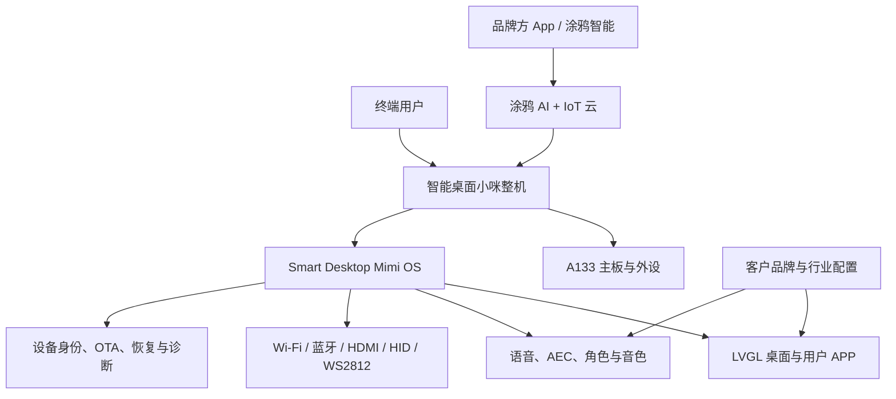

# 智能桌面小咪：带屏桌面 AI 终端解决方案

> 资料版本：V1.0（2026-09-14）
>
> 软件基线：Smart Desktop Mimi 1.0.7
>
> 定位：面向品牌商、方案商与行业客户的可贴牌软硬件参考方案

> 上图为方案阶段概念视觉，不代表已冻结的工业设计或量产外观。

## 一句话介绍

智能桌面小咪是一套基于全志 A133 与 Tina Linux 的带屏桌面 AI 终端方案。
客户可从标准整机快速起步，并按需要定制品牌 UI、AI 角色、音色、设备面板、
行业知识与外设能力，而不必从主板驱动、音频链路和量产系统重新开发。

## 客户价值

- **缩短产品验证周期**：已有可运行参考整机、系统镜像和量产构建链路。
- **一次整合多种交互**：屏幕、语音、Wi-Fi、蓝牙、状态灯和手机端配置统一工作。
- **可从样机走向量产**：支持一机一密、工厂烧录、设备身份校验、OTA 与恢复。
- **允许持续差异化**：品牌 UI、角色、知识、行业工具与用户 APP 可分层扩展。
- **降低平台锁定风险**：产品应用层与 Tina SDK 分离，可复现构建并保留板级差异。

## 当前平台能力

| 能力域 | 当前已实现 |
|---|---|
| 桌面交互 | 英文 LVGL 桌面，支持触摸与遥控器，包含网络、蓝牙、AI、视频、设置和升级页面 |
| AI 对话 | 涂鸦 AI 自由对话、英文识别与回复、流式文字和语音输出、AEC 与人声打断 |
| 手机端 | 涂鸦智能绑定、在线状态同步、角色与音色等设备面板配置 |
| 音频 | ALSA/DAUDIO 采集与播放，默认音量 50%，蓝牙 PCM 与诊断链路 |
| 网络 | Wi-Fi 扫描、连接、自动重连，MQTT 在线状态与数据点同步 |
| 视觉与控制 | HDMI 输入预览、截图、H.264 WebRTC、USB HID 键盘鼠标控制 |
| 扩展平台 | 受签名和权限控制的用户 APP、MCP 工具层与浏览器管理入口 |
| 状态反馈 | WS2812 联网、聆听、思考和说话状态，带重复帧与异常频闪抑制 |
| 系统维护 | A/B OTA、失败回滚、恢复镜像、版本审计和 100ask Cloud OTA 接口 |
| 凭据安全 | Tuya UUID/AuthKey 与云端设备密钥按设备注入，不进入通用固件和源码仓库 |

离线唤醒词由所选模型决定。标准版本只承诺随交付镜像一同验证过的模型；新的
英文唤醒词、定制声学模型或多语言唤醒属于单独评估项。

## 解决方案架构

## 三档交付产品

### 1. 标准方案版

适合希望快速验证市场的品牌和渠道商。

- A133 标准主板或参考整机。
- Smart Desktop Mimi 标准系统镜像。
- 涂鸦智能配网、绑定和设备面板。
- 标准英文 UI、AI 对话和系统升级。
- 烧录、License 注入、恢复与验收文档。

### 2. 品牌定制版

适合拥有自有品牌并需要差异化体验的客户。

- 包含标准方案版全部内容。
- 品牌名称、启动画面、配色、桌面 UI 和包装素材定制。
- AI 角色、音色、提示词和知识内容配置。
- 涂鸦 OEM App、公共 App 面板或客户自研 App 接入支持。
- 客户指定外壳、屏幕、麦克风、扬声器的适配与验证。

### 3. 行业解决方案版

适合展厅、酒店、零售、办公终端和垂直服务场景。

- 包含品牌定制版能力。
- 行业知识库、业务流程和 MCP 工具接入。
- HDMI/IPKVM 与受控电脑操作能力。
- 私有设备管理、日志、OTA 策略和运维 SLA。
- 批量设备、账号、区域与版本运营支持。

## App 路线

产品可按投入和阶段选择三条路径：

1. **验证期**：直接使用涂鸦智能公共 App 与设备面板，最快形成可售样品。
2. **品牌期**：采购涂鸦 OEM App，替换名称、图标、协议和品牌视觉。
3. **规模期**：通过涂鸦 App SDK 或自有后台构建完全自主的用户体验。

涂鸦官方也将公共 App、OEM App 和 SDK App 作为逐级投入的应用方案：
[Tuya App Development Solution](https://developer.tuya.com/en/app/)。

## 标准交付物

- 主板、参考整机或客户指定形态的试产样机。
- 可烧录固件、恢复镜像、SHA-256 与版本发布说明。
- SDK 板级差异包和产品应用源码的约定版本。
- 工厂烧录脚本、SN/License 注入工具和操作规范。
- 屏幕、音频、网络、灯效和云连接的工厂检测清单。
- OTA、回滚、远程诊断与售后恢复说明。
- 第三方组件清单、开源许可说明和安全注意事项。
- 客户定制需求、验收项、已知边界和变更记录。

## 量产质量门

每一个量产配置都必须重新通过以下质量门，样机成功不能代替批次验收：

| 质量门 | 建议最低验收方式 |
|---|---|
| 启动与恢复 | 连续 100 次冷启动；启动失败可通过标准恢复流程处理 |
| 网络稳定性 | 断网、弱网、路由器重启和 DHCP 变化下完成自动恢复 |
| AI 稳定性 | 72 小时连续运行，统计进程重启、对话中断、AEC 自激和误打断 |
| 音频一致性 | 每台工装检测麦克风、扬声器、底噪、失真和默认音量 |
| 云端在线 | 绑定、解绑、重绑、DP 同步、角色/音色配置和 MQTT 重连 |
| OTA 安全 | 下载中断、断电、校验失败、升级成功和失败回滚逐项验证 |
| 凭据安全 | 每台唯一身份；通用镜像、日志和仓库均不得出现设备密钥 |
| 老化与温升 | 满载和典型环境下记录温升、重启、屏幕、灯效与音频表现 |

具体阈值应在硬件、声学结构和云服务套餐冻结后写入项目验收协议。

## 合作方式

- **样机验证**：交付少量标准样机，验证客户场景与商业需求。
- **项目定制**：冻结需求、硬件配置、云服务、UI 与验收范围后收取 NRE。
- **批量供货**：按主板或整机数量报价，叠加每台软件授权和云服务套餐。
- **持续服务**：按年提供 OTA、安全维护、版本升级和远程技术支持。

客户品牌、结构件和专属内容归属按合同约定；通用平台、构建系统和可复用组件
保留为方案基础。涉及 GPL/LGPL 等开源组件时，交付和分发方式必须遵守对应许可。

## 商用合规边界

- Wi-Fi/蓝牙整机应在销售地区完成无线电型号核准或适用性确认；使用已有认证模块
  不能自动替代整机评估。
- 电源适配器、EMC、安全与最终产品分类应由认证实验室按销售形态确认。
- 语音输入、角色记忆和对话记录应遵循最小必要、明确同意、可查询和可删除原则。
- 面向儿童时应单独设计监护人同意、内容安全、防沉迷和未成年人信息保护流程。
- 对外生成式 AI 服务应使用合法来源模型与内容，并准备用户协议、投诉和应急机制。

参考：

- [涂鸦 AI 硬件开发流程](https://developer.tuya.com/en/docs/iot-device-dev/quick-start?id=Kectxdshpvsqr)
- [无线电发射设备管理规定](https://www.miit.gov.cn/gyhxxhb/jgsj/cyzcyfgs/bmgz/wxdl/art/2023/art_c3f2020cc25d468dad07d20c6d5f225b.html)
- [生成式人工智能服务管理暂行办法](https://www.cac.gov.cn/2023-07/13/c_1690898327029107.htm)

## 下一步

首个商业版本建议先生产 20 台工程样机，寻找 3～5 家真实客户试用。以客户实际
使用数据冻结一个标准 SKU，再启动结构开模、认证和百台级试产，避免过早积压库存。
